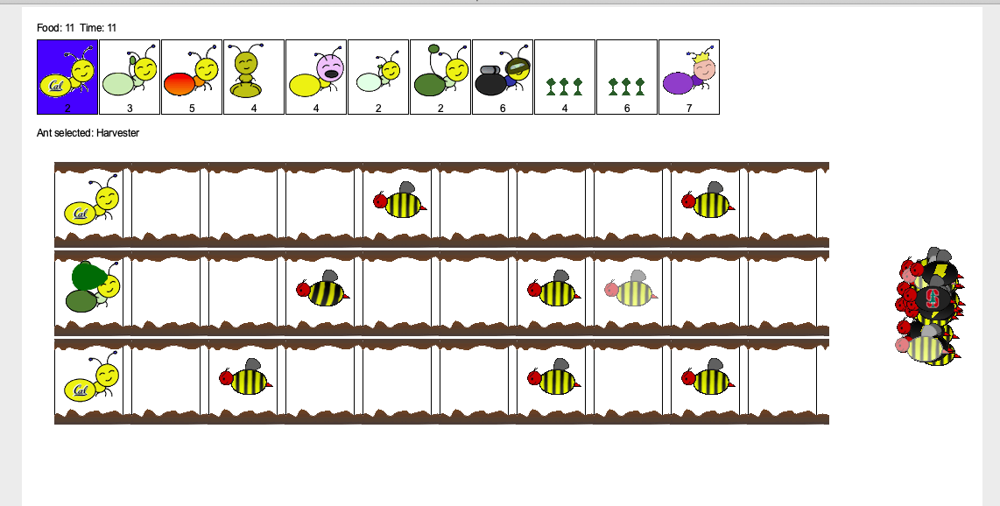

## A tower defense game: Ants Vs. SomeBees ##

## Description
Ants Vs. SomeBees is an exciting game where players engage in strategic battles between ants defending their colony and bees invading to conquer it. The game consists of a series of turns, where new bees may enter the ant colony, ants are placed to defend their colony, and all insects (ants and bees) take individual actions.

## Core Concepts
### The Colony
The game takes place in a colony consisting of interconnected Places forming a tunnel. Bees can travel through this tunnel. The colony also possesses food, which can be used to place ants in the tunnel.

### Places
Places are links that form the tunnel in the colony. A single ant can be placed in each place, while many bees can occupy a single place.

### The Hive
The Hive is where bees originate, and they enter the ant colony to launch their invasion.

### Ants
Players can place different types of ants in the colony to defend against the bees. Each ant type has a unique action and requires a specific amount of food from the colony to be placed. Basic ant types include HarvesterAnt (adds one food to the colony each turn) and ThrowerAnt (throws a leaf at a bee each turn).

### Bees
Bees are the antagonistic forces in the game that players must defend the colony from. Each turn, a bee advances to the next place in the tunnel if no ant blocks its way, otherwise, it stings the ant. The player loses if at least one bee reaches the end of a tunnel.
