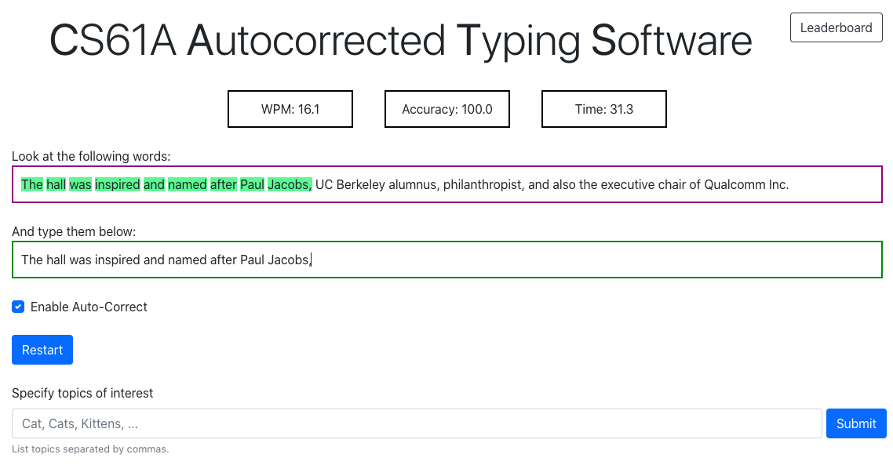

## Typing Speed and Autocorrect Program

## Description

This project involves creating a program to measure typing speed and implementing typing autocorrect. 
The program will measure how fast a user types and attempt to correct any spelling mistakes made during typing.

## Logistics

The project is worth 20 points, with 19 points allocated for correctness and 1 point for submitting Phase 1 by the checkpoint date.

