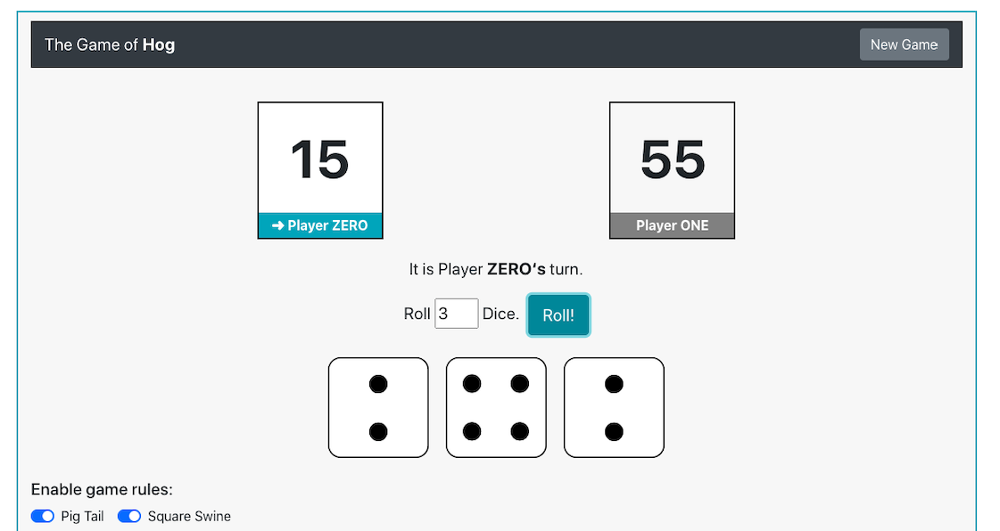

## Dice Game of Hog

## Description

 Hog is an engaging dice game where two players take turns trying to be the first to reach at least GOAL total points (defaulting to 100). 
  Each player selects the number of dice to roll, up to 10, and their score for the turn is the sum of the dice outcomes. However, rolling too 
  many dice risks receiving a Sow Sad penalty of 1 point if any outcome is a 1. 

## Special Rules

### Pig Tail: 
A player who chooses to roll zero dice scores 2 * abs(tens - ones) + 1 points, where tens and ones are the tens and ones digits of the opponent's score. 
The ones digit refers to the rightmost digit, and the tens digit refers to the second-rightmost digit.

### Square Swine: 
After a player gains points for their turn, if the resulting score is a perfect square, their score is increased to the next higher perfect square.
A perfect square is any integer n where n = d * d for some integer d.
